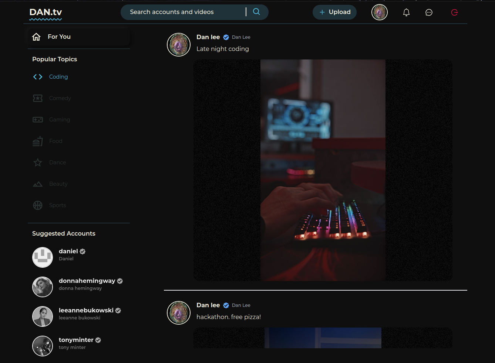
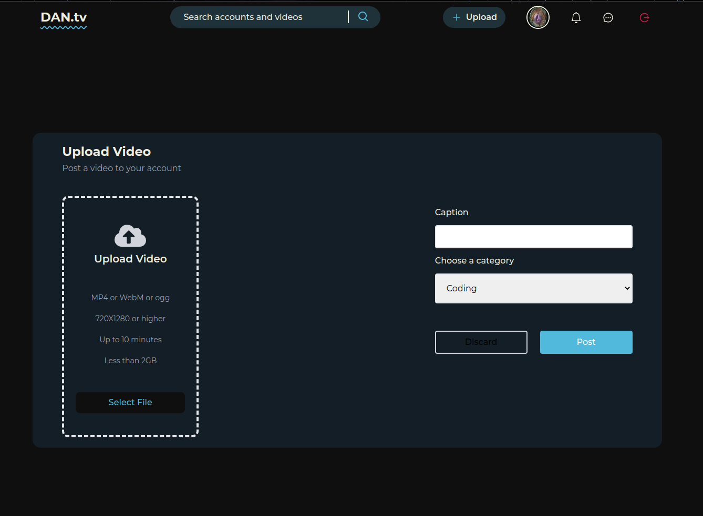
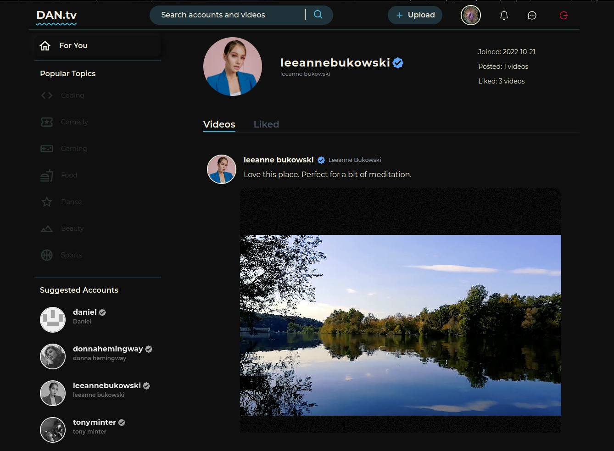
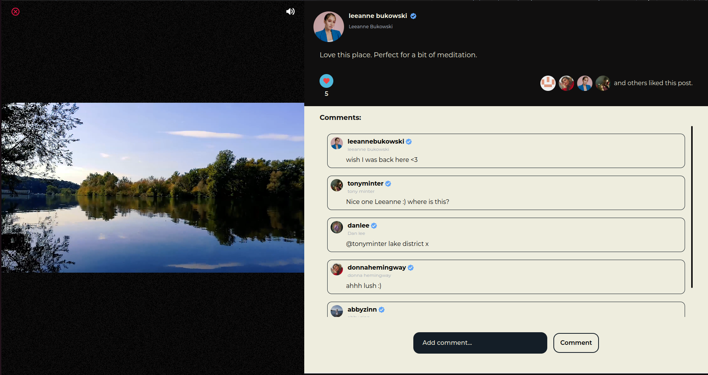

## Welcome to Dan.tv

### A video social media application.

### https://dan-tv.vercel.app/

---

## Features and functionalities include;

- Account and profile creation.

- Video Uploads.

- Commenting and Liking.

- Search functionality; query against both user account names and video descriptions

- Page transitions and micro-interactions. My favourite being the 'heart beat' interaction when a user 'likes' a video.

---

### Front-end 

- Next.js
- TypeScript
- Tailwind CSS
- Framer-Motion.

### Back-end 
- Sanity.io CMS; Content entered manually by an ADMIN through the sanity studio or by a user via the UI.
- Authentication and session management handled using google's oAuth 2.0.

---
